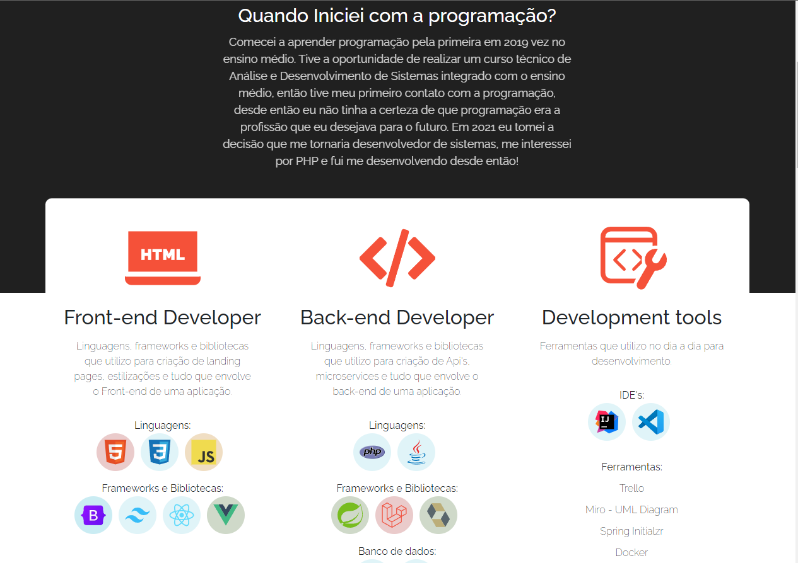

# Portfólio
 




> Portfólio criado com o intuito de divulgar o meu trabalho como desenvolvedor, e ter uma ferramenta para mostrar para recrutadores o meu potencial para agregar valores para a empresa.

### funcionalidades

O projeto se encontra em desenvolvimento:

- [x] Navbar
- [x] Header
- [x] seção de projetos
- [x] TimeLine
- [x] Footer
- [x] Responsividade
- [ ] Consumir minha própria aplicação de java sockets para comunicação em tempo real, para facilitar o contato do recrutador.
- [ ] Alterar estilizações
- [ ] Corrigir elementos da tela em alguns dispositivos
      


## 💻 Pré-requisitos

Antes de começar, verifique se você atendeu aos seguintes requisitos:

- Node instalado na máquina
- NPM instalado na máquina

## 🚀 Instalando o Portfólio

Para instalar o Portfólio, siga estas etapas:

clone o projeto na sua máquina
```
git clone https://github.com/bielViccari/portfolio.git
```

vá até a pasta clonada
```
cd portfolio
```


execute o npm install para instalar as dependências do composer.json
```
npm install
```


## ☕ Usando o Portfólio

Para usar o Portfólio, siga estas etapas:


Execute o comando npm start para iniciar a aplicação
```
npm run dev
```


## 🤝 Colaboradores

Agradecemos às seguintes pessoas que contribuíram para este projeto:

<table>
  <tr>
    <td align="center">
      <a href="#" title="defina o titulo do link">
        <br>
        <sub>
          <b>Gabriel Viccari</b>
        </sub>
      </a>
    </td>
  </tr>
